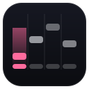

<div align="center">



# Keyfall

**Browser-side autoplay automation for Web osu!mania**

Detects the live chart, models the game's clock, and drives the site's own
keyboard input path — with optional reproducible timing humanization.

[](#disclaimer)
[](LICENSE)
[](#installation)
[](#development)
[](#development)
[](#try-it-without-the-site)
[](#try-it-without-the-site)
[](#development)
[](#contributing)


*No separate game. No renderer recreation. No modification of the site.*

</div>

---

## Overview

[Web osu!mania](https://webosumania.com/) is a browser rhythm game. **Keyfall** is
a userscript that plays a chart for you *inside that page*.

It is not a clone, a bot server, or a macro recorder. It runs as ordinary
browser-side JavaScript in the game's own tab, finds the live game instance the
page has already created, reads the chart the page has already parsed, and
dispatches plain DOM `KeyboardEvent`s on `document`. The site's own input system
receives them, judges them against the site's own clock, and scores them with the
site's own scoring. Nothing calls into private scoring code.

**The problem it solves.** The site ships an Autoplay mod, and for pure autoplay
that mod is strictly better — it is frame-exact and needs no timing model.
Keyfall exists for what that mod does not cover: a timing offset you can tune
while a map runs, configurable key mappings independent of the site's, pattern
analysis of the loaded chart, live diagnostics of what is actually being
dispatched and when, and **reproducible timing variation** for studying how much
slack a pattern tolerates. Keyfall refuses to start while the site's own Autoplay
is enabled, because two schedulers driving one input system would double-fire
every note.

**The pipeline:**

```
window.__PIXI_APP__  →  canvas  →  React fiber  →  the live Game
                                                     │
                            game.hitObjects ─────────┤  (holds arrive as a head
                            game.columnKeybinds ─────┤   tap + a hold object)
                            game.timeElapsed ────────┘
                                                     │
                              ParsedChart + KeyMapping
                                                     │
                        Timeline of InputActions ────┤  (optional humanization
                                                     │   baked in here)
                              ClockMapper ───────────┤  (least-squares fit of
                                                     │   chart time vs
                                                     │   performance.now())
                                   Scheduler ────────┘  (one rAF loop,
                                                         look-ahead arming)
                                                     │
                                        InputManager
                                                     │
                          document.dispatchEvent(KeyboardEvent)
                                                     │
                              the site's InputSystem → its ScoreSystem
```

## Features

### Autoplay engine

- **Layered site and game detection.** Three ordered strategies — the site's own
  `window.__PIXI_APP__` global, a viewport-sized-canvas scan, then a broad React
  fiber probe. Each is independent; a strategy that throws cannot break the
  others. Recognition is shape-based, never name-based, so renaming a component
  does not break it. On an unrelated site the overlay reports exactly
  `Web osu!mania not detected.`
- **Fallback chart source.** A strictly read-only network observer watches for
  `.osz` responses and parses the `.osu` entry itself with a bundled ZIP reader
  (`DecompressionStream("deflate-raw")`, no dependency). Requests are never
  altered, blocked or replayed.
- **Own `.osu` parser** for that path: 1K–18K, holds, `mirror`, `holdOff`,
  `delay`, audio offset, playback rate. The `random` mod is flagged unreliable
  and refused rather than guessed — its column permutation is generated at
  runtime and never persisted.
- **Hold-head deduplication.** The site stores every hold as *two* objects (a
  head tap carrying the hold's end time, plus the hold). The head is dropped via
  a Set pre-pass that does not care which way the pair sorts.
- **Note scheduling** by a single look-ahead loop, not a timer per note.
- **Taps, holds, chords, jacks and streams** are all classified, and the
  classification is surfaced: taps, holds, chord notes, largest chord, jacks,
  longest stream, peak and average NPS, and the shortest same-column interval.
- **Dynamic key count, 1K–18K.** Read from the chart, cross-checked against
  `columnKeybinds.length` and the highest column the chart references. Nothing
  assumes 4K; a chart referencing a column beyond the detected count raises the
  effective count rather than dropping notes.
- **Ordering matches the site's own replay player** — stable sort on time with no
  type tiebreaker, so a hold ending exactly where the next note on that column
  begins releases *before* pressing instead of swallowing it.
- **Keyboard input handling** through synthetic `KeyboardEvent`s with the correct
  `code` and `repeat: false`.

### Humanization

Optional, off by default, and reproducible from a seed.

- Seeded PRNG (mulberry32) — same seed plus same chart produces identical timing.
- Gaussian or uniform per-note variation, matched for variance so switching
  distribution changes the shape without changing the spread.
- Short-term drift (mean-reverting Ornstein–Uhlenbeck) and long-term drift
  (bounded random walk), both hard-clamped so neither can become an accidental
  offset.
- Pattern-aware variation: jacks and streams tighten, because a player locked
  into a rhythm is more consistent than when sight-reading a lone note.
- Rhythm lock inside jacks — blends toward the previous note's delta so the
  *interval* stays tight even while the absolute position wanders.
- Chord coherence: notes sharing a timestamp share one delta, so a chord never
  smears into an arpeggio.
- Independent hold-release variation, clamped so a tail can never pass the next
  press on that column.
- Fatigue: variance grows and timing drifts late across the chart, normalised
  over the chart's own span.
- Live statistics — mean, sd, min/max, mean absolute error, and clamp counts.

See [Humanization in depth](#humanization-in-depth).

### User interface

- START / PAUSE / STOP / EMERGENCY STOP controls, with a status readout.
- Notes remaining, accuracy, combo and score — read from the site's own score
  system, not recomputed and not scraped from the Pixi HUD.
- Live keyboard visualisation that lights as the automation presses columns.
- Timing Offset slider, −200ms to +200ms in 1ms steps.
- Draggable by the title bar, resizable from the bottom-right corner, collapsible
  to a mini bar, with adjustable opacity, UI scale and accent colour.
- Five settings tabs: General, Timing, Humanize, Input, Appearance.
- Debug mode with a structured `[DEBUG]` snapshot and a buffered log.
- Console API on `window.Keyfall`.

### Compatibility

- Modern evergreen browsers (Chrome/Edge 103+, Firefox 113+, Safari 16.4+ — the
  floor is `DecompressionStream`, used only by the fallback chart parser).
- Survives SPA transitions: gameplay opening and closing, beatmap changes without
  a page refresh, replay and results screens, and returning to song select. A new
  beatmap stops the old scheduler, clears the chart, re-detects, re-parses and
  resets stats.
- Responsive, compact dark UI.

## Humanization in depth

```
Beatmap
   ↓
Note Parser        game.hitObjects → ParsedChart. Drops the site's duplicated
   ↓               hold heads; keeps 1K–18K, holds, chords.
Pattern Analyzer   Classifies every note as jack / stream / hold / isolated, and
   ↓               counts chord members. Feeds both the analysis readout and the
Humanization       variation scaling.
   Engine
   ↓
Timing Scheduler   Consumes the perturbed action list unchanged. It does not know
   ↓               humanization exists — the deltas are already baked into the
Input Manager      timestamps it is given.
   ↓
Browser Input
```

Humanization sits between the pattern analyzer and the scheduler deliberately. It
is a property of *chart interpretation*, not of playback: it has to be applied
before the ordering sort so that chords stay together and same-column ordering
survives. Applying it at fire time instead would have no way to keep a chord on
one timestamp.

### Why two passes

A hold's release must be clamped against the *next* press on that column, and
that press's shifted time is not known until every note delta exists. A single
streaming pass cannot do this — it would clamp against a ceiling that has not been
computed yet, and a late release would swallow the next note. So `prepare()`
computes every note delta and every release ceiling first; reading an edge
afterwards is a pure lookup, and no call ordering can change the output.

### The two invariants

Perturbation that breaks either of these does not sound wrong — it silently
breaks playback:

1. **Chords stay together.** Notes sharing a timestamp share one delta.
2. **Same-column order is preserved.** The site's `hit()` early-returns while a
   column is already down. If a hold's release lands after the next press on that
   column, the press is lost *and* the key stays pinned until the next event on
   that column.

So every delta is clamped against the previous same-column note, and a note
starting exactly where a hold ends inherits that hold's delta so the pair stays on
one timestamp and construction order decides it.

### Configuration

| Setting | Range | Default | What it does |
|---|---|---|---|
| Enable humanization | on/off | **off** | Master switch. Off means frame-exact. |
| Seed | any non-negative integer | `0` | Same seed + same chart = identical timing. |
| Strength | 0 – 1 | `0.35` | Scales every component. At 1 the per-note sd is 12ms. |
| Distribution | gaussian / uniform | `gaussian` | Shape of the random component, variance-matched. |
| Short drift | 0 – 1 | `0.4` | Fast mean-reverting wobble. |
| Long drift | 0 – 1 | `0.25` | Slow bounded walk across the whole chart. |
| Pattern aware | 0 – 1 | `0.6` | How much jacks and streams tighten up. |
| Hold release | 0 – 1 | `0.5` | Extra variation on a hold's release edge only. |
| Fatigue | 0 – 1 | `0.3` | Growing variance and a late bias over the chart. |

`Strength` is sized against osu!mania's judgement windows — the tightest is
roughly ±22ms. At the default 0.35 the per-note sd is about 4ms, so most notes
still land in the best window while the run stops looking machine-perfect. At 1.0
timing is genuinely sloppy, which is the point: it lets you feel how much slack a
pattern has.

### What humanization is not

It is not detection evasion, and it cannot be. Every event this tool sends is
`isTrusted === false`, which a site can check in one line. Humanization makes the
*timing* less machine-like; it does not make the *events* any less synthetic. It
exists for timing practice and experimentation. See [`docs/SAFETY.md`](docs/SAFETY.md).

## Architecture

```
Website (webosumania.com)
  ↓
Detection Layer        src/detect/  siteDetection · pixiHook · fiber · chartSource
  ↓
Beatmap Parser         src/detect/  buildContext · osuFileParser
  ↓
Pattern Analyzer       src/chart/   timeline.ts → ChartAnalysis
  ↓
Humanization Engine    src/humanize/ humanizer.ts   (+ src/util/rng.ts)
  ↓
Scheduler              src/timing/  scheduler.ts · clock.ts
  ↓
Input Manager          src/input/   InputManager.ts
  ↓
Browser Input          document.dispatchEvent(new KeyboardEvent(…))
```

Orchestration sits beside that pipeline, not inside it:

| Module | Owns | Deliberately does *not* do |
|---|---|---|
| `detect/siteDetection` | "is this Web osu!mania?" | Anything about gameplay |
| `detect/pixiHook` | Ordered acquisition strategies | Interpreting the game it finds |
| `detect/fiber` | React fiber traversal, shape-based recognition | Any name-based coupling |
| `detect/buildContext` | `Game` → `ParsedChart` + `KeyMapping` | Scheduling or input |
| `detect/chartSource` | Read-only `.osz` observation | Modifying any request |
| `detect/osuFileParser` | `.osu` text → chart (fallback path) | Reading the live game |
| `chart/timeline` | Chart → ordered `InputAction[]`, pattern analysis | Timing or input |
| `humanize/humanizer` | Reproducible per-note timing deltas | Knowing what a key is |
| `timing/clock` | `performance.now()` ↔ chart-time linear model | Deciding what to fire |
| `timing/scheduler` | Look-ahead arming, catch-up, batching, cursor | Knowing what a note is |
| `input/InputManager` | Synthetic key events, held-state tracking | Deciding *when* |
| `engine/guards` | Stuck-key, liveness, lifecycle safety | Gameplay logic |
| `engine/stats` | Reading the site's own score/combo/accuracy | Recomputing accuracy |
| `engine/engine` | Phase machine, wiring, teardown | Any of the above directly |
| `ui/*` | Overlay, keyboard view, debug panel | Touching engine internals |
| `core/settings` | Persistence, validation, clamping | Knowing what settings mean |

Each layer only sees the types of the layer below it. Nothing downstream of
`buildContext` ever touches a site object, which is what makes the detection
strategies independently replaceable — see
[`docs/UPDATING.md`](docs/UPDATING.md#step-3-add-a-new-detection-strategy).

Engine phases: `IDLE → DETECTING → READY → RUNNING ↔ PAUSED → STOPPING/ERROR`.

Full reasoning behind the design decisions is in
[`docs/ARCHITECTURE.md`](docs/ARCHITECTURE.md). The site facts this depends on,
with source references, are in [`docs/SITE-CONTRACT.md`](docs/SITE-CONTRACT.md).

## Installation

### Requirements

- A modern evergreen browser (see the compatibility badges above).
- A userscript manager — [Tampermonkey](https://www.tampermonkey.net/) or
  Violentmonkey — for the recommended install path.
- No accounts, no permissions beyond what a userscript manager already asks for,
  and no network access of its own. Settings persist to a single namespaced
  `localStorage` key (`keyfall:settings:v1`); the site's own storage is never
  touched.

### Get it

**One-click (recommended).** With Tampermonkey or Violentmonkey enabled, open
this URL in a browser tab:

```
https://raw.githubusercontent.com/tussle1/Keyfall/main/release/keyfall.user.js
```

Your userscript manager intercepts the `.user.js` and shows its install page —
click **Install**. `release/keyfall.user.js` is a committed build artifact that
exists precisely so this URL is stable, and the header's `@updateURL` /
`@downloadURL` point at the same file, so the manager can offer updates when a
new build is published. (It is marked `linguist-generated`, so it does not skew
the repository's language statistics.)

**From source.** `dist/` is a build output and is gitignored, so build first:

```bash
git clone https://github.com/tussle1/Keyfall.git keyfall
cd keyfall
npm install
npm run build
```

That produces:

| File | Use |
|---|---|
| `dist/keyfall.user.js` | Userscript — the recommended path |
| `dist/keyfall.js` | Plain script for a `<script>` tag or a devtools snippet |
| `dist/bookmarklet.txt` | Whole tool as a `javascript:` URL (see the warning) |
| `dist/bookmarklet-loader.txt` | ~300-byte loader; replace `RAW_URL_HERE` |

Node 20+ is needed to build. The bundle itself has **zero runtime dependencies**.

### Load it

**Userscript.** Install from the raw URL above, or open `dist/keyfall.user.js`
and accept the install prompt, or drag it onto your userscript manager's
dashboard. Then load `webosumania.com` — the overlay appears in the top-left.

**Plain script.** Load `dist/keyfall.js` however you like. It exposes
`window.Keyfall`.

**Bookmarklet.** `dist/bookmarklet.txt` is about 150 KB, and most browsers
truncate bookmark URLs past roughly 64 KB — so it will not work as-is in most
setups. Two options that do: host `dist/keyfall.js` somewhere you control and put
that URL into `dist/bookmarklet-loader.txt`, or just use the userscript, which has
no size limit and survives navigation.

## Usage

1. **Open the site.** Go to <https://webosumania.com/>. If Keyfall does not
   recognise it, the overlay says `Web osu!mania not detected.` and produces no
   input.
2. **Confirm it loaded.** The overlay appears top-left. In the console,
   `Keyfall.version` and `Keyfall.diagnostics()` both work.
3. **Open a mania chart and start the play.** Detection is automatic; the overlay
   reports the key count, note count and pattern breakdown.
4. **Check the key mapping.** Settings → Input shows what was read from the site.
   The source should read `site`. If it says `fallback`, click a column and press
   the key you want.
5. **Set timing.** Settings → Timing. Leave Offset at 0 first and see how it plays,
   then correct for your output latency.
6. **Optionally enable humanization.** Settings → Humanize. Pick a seed, set a
   strength, and watch the statistics readout.
7. **Start.** Press `G` or click START.
8. **Monitor.** Status, notes remaining, accuracy, combo and score update live.
   The keyboard visualisation lights as columns are pressed. Press `Right Shift`
   twice to hide the panel if it is in the way.
9. **Stop or restart.** `X` stops and releases everything. `B` pauses and
   resumes. `Z` is the emergency stop — total reset, every key released,
   detection re-armed. Changing beatmap needs no action: the new chart is picked
   up without a refresh.

<div align="center">

*Screenshot placeholders — replace with real captures.*

| | |
|---|---|
|  |  |
| `assets/screenshot-overlay.png` | `assets/screenshot-humanize.png` |

</div>

### Console API

```js
Keyfall.start();  Keyfall.pause();  Keyfall.resume();
Keyfall.stop();   Keyfall.emergencyStop();

Keyfall.phase;            // "IDLE" | "DETECTING" | "READY" | "RUNNING" | …
Keyfall.chart;            // the parsed chart
Keyfall.mapping;          // the resolved key mapping
Keyfall.stats();          // notes remaining, accuracy, combo, score
Keyfall.diagnostics();    // everything, including clock fit and jitter

Keyfall.setOffset(-12);
Keyfall.setDebug(true);
Keyfall.showUI();  Keyfall.hideUI();
Keyfall.resetSettings();
Keyfall.uninstall();
```

## Configuration

Every setting persists to `localStorage` and is clamped on load — a corrupted or
hand-edited value cannot put the tool into an invalid state.

### General

| Setting | Description | Default |
|---|---|---|
| Enable autoplay | Master switch for the engine | On |
| Show overlay | Whether the panel is in the DOM | On |
| Show keyboard | The live keyboard visualisation | On |
| Debug mode | Structured `[DEBUG]` snapshot and log | Off |

### Timing

| Setting | Range | Description | Default |
|---|---|---|---|
| Timing Offset | −200 … +200 ms | Shifts every input. Positive fires earlier. | `0 ms` |
| Lookahead | 20 … 500 ms | How far ahead of the playhead to arm precise timers | `120 ms` |
| Input delay | −60 … +60 ms | Extra lead to compensate for dispatch latency | `0 ms` |
| Spin window | 0 … 20 ms | Bound on the busy-wait used for sub-millisecond placement | `6 ms` |

### Humanize

See the [humanization table](#configuration-1). Off by default.

### Input

| Setting | Description | Default |
|---|---|---|
| Key mapping | Per-key-count overrides; click a column, then press a key | Read from the site |
| Use secondary keybind | Press both of a column's bindings when the site has two | Off |
| Hotkeys | Reconfigurable; warns on collision with a site keybind | Right Shift, G B X Z |

### Appearance

| Setting | Range | Default |
|---|---|---|
| UI scale | 0.6 – 2 | `1` |
| Opacity | 0.15 – 1 | `0.92` |
| Accent colour | `#rgb` / `#rrggbb` | `#ff6b9d` |
| Position, size, collapsed | Draggable / resizable / collapsible | `16, 16` · `296 px` · expanded |

## Key mapping

The mapping is read from the site, in this priority order:

1. `game.columnKeybinds` — the bindings already resolved for *this run*.
2. `game.settings.keybinds.keyModes[keyCount - 1]`.
3. Your saved per-key-count override.
4. A generated fallback layout.

Reading the live value first is what makes a mid-session rebind work: the site
deep-clones its settings when a game is constructed, so those are the bindings
that play is actually using.

```
4K     Column 1 → D    Column 2 → F    Column 3 → J    Column 4 → K
7K     Column 1 → S    Column 2 → D    Column 3 → F    Column 4 → Space
       Column 5 → J    Column 6 → K    Column 7 → L
```

Fallback layouts exist for 1K through 10K+; beyond that, extended suffix codes
are generated. **To change a mapping:** Settings → Input → click a column → press
the key. Overrides are stored per key count, so a 4K override does not affect 7K.
A `fallback` source means the site's keybinds could not be read — the tool still
plays, but you should set the mapping manually.

Each column can have two bindings on the site. `Use secondary keybind` presses
both, which matters if your own setup expects it.

## Hotkeys

| Key | Action |
|---|---|
| `Right Shift` | Toggle UI (panel ⇄ mini bar ⇄ hidden) |
| `G` | Start |
| `B` | Pause / resume |
| `X` | Stop |
| `Z` | **Emergency stop** — releases every key immediately, full reset |

The UI toggle defaults to `Right Shift` — a modifier the site never binds to a
column — and the four action keys are letters chosen from the set that appears
in *no* column layout at any key count, so a hotkey can never double as a
column key. All five are reconfigurable in Settings → Input, which opens
straight onto the Hotkeys section: click a key chip, press the new key (the
chip glows and reads "press a key…" while listening), `Esc` cancels, and
**Reset hotkeys to defaults** puts Right Shift / G / B / X / Z back. Binding a
key that another Keyfall action already uses is refused with a notice. Migration is per key: a stored code that matches an earlier shipped default
(the F-keys, or the interim H toggle) follows the current default forward, while
any other stored code is treated as your choice and left alone. The manager only acts on trusted
events, in the capture phase, and ignores `repeat` and any ctrl/meta/alt
combination — so a hotkey never also registers as a column hit. If you bind a
hotkey to a code the site uses as a column keybind, you get a warning.

## Performance

- **One `requestAnimationFrame` loop** drives all scheduling. There is no timer
  per note. Each frame flushes whatever is overdue and arms at most one timer for
  the next same-timestamp batch.
- **Binary search** (`lowerBound`) for timeline position — no scanning.
- **Cached DOM references.** Every node the overlay updates is held as a field.
  Nothing queries the DOM per frame, and the site's game is read through cached
  references rather than re-traversed.
- **Minimal DOM writes.** `setText` and `setDataset` no-op when the value is
  unchanged, so DOM churn is proportional to actual change rather than to frame
  rate.
- **Buffered debug output.** The log accumulates and flushes on a 150ms interval
  instead of appending per event, and allocates nothing at all while debug mode is
  off.
- **Write-coalesced settings.** Persistence is debounced at 250ms, so dragging a
  slider does not hammer `localStorage`.
- **Event-driven detection**, with a 700ms poll only as the fallback.
- **Chart parsed once.** The timeline is rebuilt only when something that actually
  affects it changes — compared by signature, not on every settings write.
- **Bounded work everywhere.** Catch-up is capped at 256 actions per frame and
  reports an overrun instead of jamming every column at once. The precision
  busy-spin has both an absolute deadline and a hard iteration cap, so a bad clock
  prediction cannot freeze the tab.
- **Full listener cleanup.** Every listener, timer and observer is registered
  through a disposer list and removed on `uninstall()` — no stale handlers after a
  SPA transition.

## Debugging

Settings → General → **Debug mode**, or `Keyfall.setDebug(true)`.

The panel then shows a structured snapshot, refreshed on the stats loop:

```text
[DEBUG]
Phase: RUNNING
Detected via: pixiGlobal
Chart detected
Keys: 7
Notes: 2,481
Actions: 4,962
Chart: 7K · 2481 notes · 1:52
Current time: 0:42.183
Next note: 0:42.201
Column: 4
Action: KEYDOWN
Clock: slope 1.000000 · err 1.83ms · samples 24 · confident yes
Scheduler: cursor 1042/4962 · armed 1 · fired 1,041 · dropped 0
Jitter: last 0.42ms · avg 0.31ms
Input: held 0 · down 1,041 · up 1,041 · dup 0 · fail 0
Humanize: seed 20261007 · gaussian · strength 0.35 · mean +0.84ms · sd 4.11ms · range -11.2…13.6ms · clamped 0
Patterns: 318 jacks · 96 streams · 204 chord notes · 152 holds · 1711 isolated
Site state: PLAY
```

`Next note` / `Column` / `Action` tell you exactly what is about to be dispatched
and when. `Jitter` is *measured* scheduling error — how far the chart clock had
travelled past the target when the action fired — not added variation. `dup` counts
suppressed duplicate presses and `fail` counts dispatch failures; both should stay
at zero.

The same data is available programmatically, which is usually faster than reading
a panel:

```js
Keyfall.diagnostics()
```

For deeper triage — which layer broke, and what to change — see
[`docs/UPDATING.md`](docs/UPDATING.md).

## Safety

**Never leaving a key stuck is the hard requirement.** A pinned column is not a
cosmetic bug: it drains HP, breaks the run, and persists into the next screen.

1. **Every teardown path releases first.** `stop()`, `pause()`,
   `emergencyStop()`, `dispose()`, chart completion, play failure and detection
   loss all call `releaseAll()` before anything else.
2. **A 100ms state monitor** checks that the game is still alive and still in
   `PLAY`. It runs on a timer rather than on the firing path, because a failure
   *between* notes would otherwise go unnoticed with a hold still down. It covers
   `RUNNING`, `PAUSED` and `READY` — a play can fail after the last action, while
   the site transitions to its results screen.
3. **A 500ms watchdog** cross-checks how long each column has been held against
   the chart clock and force-releases past a 20s timeout.
4. **Lifecycle listeners.** `visibilitychange`, `pagehide`, `beforeunload` and
   `blur` all release keys. A backgrounded tab gets throttled timers, which would
   wreck scheduling, so the engine pauses and releases rather than firing late.
5. **Input-state verification.** After dispatching, our held set is compared
   against the site's own `pressedColumns`. A persistent mismatch means the
   keybinds changed underneath us, so the engine stops rather than playing garbage.
6. **A release is sent even without a recorded press.** If the site believes a
   column is down and we have no record of pressing it, we dispatch the release
   anyway. A spurious `keyup` is harmless; a missing one is not.
7. **Errors never escape.** Every strategy, emitter subscriber, scheduled task and
   dispatch is wrapped. A throw degrades to a log line and a safe stop.

All failure paths end with the same message: **`Autoplay stopped safely.`**

**Emergency stop (`Z`)** is the unconditional version: release every key, halt
the scheduler, drop the chart, hard-reset the clock, and re-arm detection. It
works from any phase, including mid-hold and during an error.

### What this project does not do

No anti-cheat bypass. No detection evasion. No `isTrusted` spoofing — synthetic
events are dispatched honestly and remain `isTrusted === false`. No browser
security bypass. No credential theft. No cookie extraction (`document.cookie` is
never read). No account manipulation. No network modification — the `.osz`
observer is strictly read-only. No remote code execution. No memory manipulation.

The honest limitation: any site that checked `event.isTrusted` would render this
entire approach inert in one line. That asymmetry is the point — this is a
client-side convenience, not an adversarial capability. Full reasoning, including
fair play, is in [`docs/SAFETY.md`](docs/SAFETY.md).

## Troubleshooting

### Autoplay does not start

Run `Keyfall.diagnostics()` and read top-down — each field points at one module.

| Symptom | Likely cause | Fix |
|---|---|---|
| `site: "unknown"` | Not on a recognised host | Load `webosumania.com`. The message is `Web osu!mania not detected.` |
| `via: null` | The game instance could not be reached | Start the play first; gameplay must be live. Then see below. |
| `chart: null` but `via` is set | The site's field names changed | [`docs/UPDATING.md`](docs/UPDATING.md) |
| Refuses, mentions autoplay | The site's own Autoplay mod is on | Turn it off — Keyfall will not double-fire against it |
| Refuses, mentions replay | A replay is playing | The site's `ReplayPlayer` already drives input |
| Refuses, mentions random | The `random` mod is on and the fallback parser is in use | Disable `random`, or play from the live game path |
| START does nothing | No chart detected yet | Check the overlay notice; a failed beatmap download leaves nothing to parse |

If `via` is null while a map is playing:

```js
window.__PIXI_APP__                                  // the site sets this during play
document.querySelectorAll("canvas").length
Object.keys(document.querySelector("canvas")).filter(k => k.startsWith("__react"))
```

### Inputs are mistimed

Check `Keyfall.diagnostics().clock` first:

- `confident: false` after several seconds — the fit is not converging. `slope`
  should equal the playback rate (1 at normal speed).
- `errorMs` above ~10 — the two clocks are no longer linearly related.
- `discontinuities` climbing steadily — something is being misread as a seek.

Then, in order: your **audio/output latency** (use Timing Offset as a constant
musical correction), **browser scheduling** (a backgrounded or heavily loaded tab
gets throttled timers — keep the tab focused), and **humanization** (if it is on,
timing is *deliberately* imperfect; turn it off to confirm). `Jitter` in the debug
snapshot separates scheduler error from all of these.

### Keys become stuck

Press `Z`. That releases every key unconditionally and resets the engine.

This should not happen: the state monitor polls at 100ms, the watchdog at 500ms,
and lifecycle listeners cover tab-hide, blur and unload. If you can reproduce a
stuck key, please report it with `Keyfall.diagnostics()` output — it is treated as
a bug, not a limitation.

### The UI does not appear

```js
Keyfall.showUI();          // re-enable the overlay
Keyfall.uninstall();       // then reload the page to reinitialise cleanly
```

If `window.Keyfall` is undefined, the script did not load — check your userscript
manager's console for an error, and confirm you are on a recognised host. Loading
it twice is refused by design and logs a warning telling you to `uninstall()`
first.

## Development

```bash
npm install
npm run build      # → dist/keyfall.js, dist/keyfall.user.js, dist/bookmarklet*.txt
npm run watch
npm test           # 229 unit + integration tests
npm run smoke      # builds, then runs the SHIPPED BUNDLE against a stubbed site
npm run verify     # typecheck + test + smoke
npm run demo       # sandbox at http://localhost:5173/
```

**Requirements:** Node 20+. Two dev dependencies only — `esbuild` and
`typescript`. The shipped bundle has zero runtime dependencies.

Tests run on `node --test` with Node's native type stripping: no test framework
and no transform step. Node strips types but still requires fully specified ESM
paths, while the source uses extensionless imports (correct for a bundler and for
`tsc`), so `test/helpers/tsLoader.mjs` is a resolve hook that adds the missing
`.ts`. `test/helpers/domStub.ts` provides a minimal DOM and a **manual clock** —
nothing runs until `advance()` is called, so timing assertions are exact rather
than flaky.

**Run the smoke test after any change.** It loads the actual bundled bytes through
the real bootstrap path. That is how the hold-head bug in
[Notable bugs](#notable-bugs-found-and-fixed) was found: all 156 unit tests passed
while the shipped bundle released every hold 12ms after starting it.

### Code organisation

```
src/
  main.ts            bootstrap, console API, wiring
  constants.ts       every tunable threshold in one place
  types.ts           shared type vocabulary
  detect/            site detection, game acquisition, chart parsing
  chart/             timeline construction and pattern analysis
  humanize/          reproducible timing variation
  timing/            clock model and look-ahead scheduler
  input/             synthetic keyboard events and held-state tracking
  engine/            phase machine, guards, stats
  core/              settings persistence and validation
  ui/                overlay, keyboard view, debug panel, styles
  util/              emitter, helpers, seeded RNG
test/                one file per module, plus integration
demo/                a stub site implementing the documented contract
scripts/             build, smoke test, demo server
docs/                site contract, architecture, safety, updating
```

### Adding a module

Detection strategies are the common case, and they are independent functions in
`detect/pixiHook.ts`:

```ts
export const STRATEGIES: Strategy[] = [
  { name: "pixiGlobal", cost: "low",    run: viaPixiGlobal },
  { name: "canvasScan", cost: "medium", run: viaCanvasScan },
  { name: "fiberProbe", cost: "high",   run: viaAnyFiber },
  // add here — cheapest and most reliable first
];
```

Each returns `GameLike | null` and is called inside a `try`/`catch`, so a new
strategy that throws cannot break the others. Nothing else changes: `acquireGame`
reports which one succeeded, and that string appears in `diagnostics().via`.

### Try it without the site

`npm run demo` serves a sandbox containing a stub that implements the documented
site contract (`demo/stub-game.js`) and the real, unmodified bundle running
against it. Pick a chart — 4K with holds and chords, a 7K stream, or a 10K map —
press **Play**, then press **G**.

It is a demonstration harness, not a port of the game. It exists so the bundle's
detection, clock fitting, scheduling, humanization and input paths can be
exercised end to end without the live site.

## Contributing

1. **Fork** the repository and create a branch from `main`.
2. **Make the change.** Keep it in the layer it belongs to — a detection problem
   is fixed in `detect/`, a timing problem in `timing/`. Nothing downstream of
   `buildContext` should ever touch a site object.
3. **Add a test.** If you changed timing or ordering behaviour, this is not
   optional. The two hardest bugs in this codebase were both invisible in manual
   testing and obvious under the stubbed clock.
4. **Run `npm run verify`** — typecheck, 229 tests, and the bundle smoke test.
5. **Check by hand** against the real site, in this order: a 4K tap-only map, a
   map with holds (including one that ends exactly where the next note on that
   column starts), a dense stream, 7K or higher, pause and resume mid-hold, a
   beatmap change without refreshing, closing the game mid-hold, and the site's
   own Autoplay mod enabled (which must be refused).
6. **Open a pull request** describing what changed and why.

Two things that will get a change rejected: adding a runtime dependency, and
adding a `setInterval` per note. Please keep the project modular and
dependency-free — the bundle is injected into someone else's page, and every
kilobyte and every global it touches is a cost.

## Roadmap

```text
[x] Implemented
    Site detection with layered fallbacks and a precise "not detected" message
    Chart parsing from the live game, plus a read-only .osz fallback path
    1K–18K dynamic key count, never hardcoded to 4K
    Taps, holds, chords, jacks, streams — classified and reported
    Look-ahead scheduler on performance.now(), no per-note timers
    Least-squares clock model with seek/stall discrimination
    Reproducible humanization: seeded, drift, fatigue, pattern-aware
    Overlay UI: draggable, resizable, collapsible, themed, keyboard view
    Five reconfigurable hotkeys with collision warnings
    Locally persisted, validated, clamped settings
    Debug mode with a structured snapshot and buffered log
    Multi-layer stuck-key prevention and safe-stop guarantees
    SPA survival: beatmap change, gameplay close, replay and results screens
    229 tests plus a shipped-bundle smoke test
    Sandbox demo harness

[ ] Planned
    More timing profiles (presets for practice, sight-read, latency calibration)
    Improved visualisation: per-column error histogram, drift over time
    More statistics: judgement distribution over a run, error trend, NPS over time
    Additional accessibility options: high-contrast theme, reduced motion,
        larger hit indicators, remappable-everything audit
    Better chart detection for provider changes and non-.osz sources
    Wider browser verification, including mobile and gamepad-input paths
    Replay export of a humanised run
    i18n for the overlay
```

## Disclaimer

Keyfall is an independent, unofficial browser-side automation and practice tool.
It is **not affiliated with, endorsed by, or sponsored by osu!, ppy.sh, or Web
osu!mania**, and no claim of official status is made or implied. osu! and
osu!mania are the property of their respective owners; Web osu!mania is a
third-party browser implementation.

Use it responsibly. Web osu!mania keeps local high scores and, as far as the
public source shows, has no global leaderboard or ranked submission — so running
this does not take anything from another player. That is the current state of the
site, not a permanent property of it. If it ever adds ranked or shared
leaderboards, submitting an automated score would be cheating, and would also be
trivially detectable via `isTrusted`. Do not do it.

If you simply want to watch a map played perfectly, use the site's own Autoplay
mod. It is the developer's sanctioned feature and it is better at that job than
this is.

## License

MIT — see [`LICENSE`](LICENSE).

## Credits

- **[Web osu!mania](https://github.com/HecticKiwi/Web-Osu-Mania)** by HecticKiwi —
  the game this automates. Keyfall's entire design is derived from reading its
  public source, and [`docs/SITE-CONTRACT.md`](docs/SITE-CONTRACT.md) cites it
  throughout. No affiliation implied.
- **[osu!](https://osu.ppy.sh/)** by ppy.sh — the origin of the mania game mode,
  the `.osu` file format, and the scoring and hit-window model referenced here.
- **The `.osu` file format** —
  [osu! wiki](https://osu.ppy.sh/wiki/en/Client/File_formats/osu_(file_format)).
- **osu!mania scoring and hit windows** —
  [osu! wiki](https://osu.ppy.sh/wiki/en/Gameplay/Scoring).
- **[esbuild](https://esbuild.github.io/)** and **[TypeScript](https://www.typescriptlang.org/)**
  — build-time only. Neither ships in the bundle.
- **[mulberry32](https://gist.github.com/tommyettinger/46a874533244883189143505d203312c)**
  — the seeded PRNG behind reproducible humanization.
- The **Marsaglia polar method** for normal samples, and the
  **Ornstein–Uhlenbeck process** for mean-reverting short-term drift.

<div align="center">

*Built from reading the source, not from guessing at it.*

</div>
